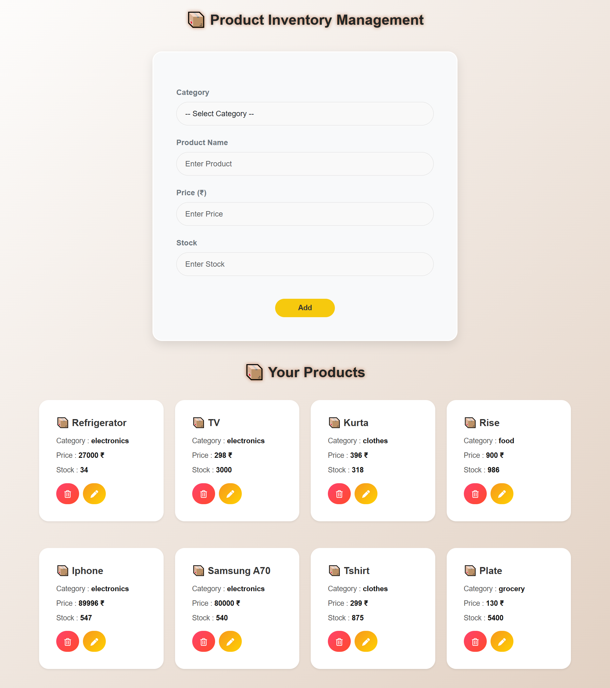

# 📦 Product Inventory Management System

This project is a **fully responsive inventory management system** developed using **React** and **Bootstrap**, designed with a clean and practical UI. Users can **add, update, delete, and manage products** with details like category, price, and stock, making it useful for **real-life shops**.

---

## 🚀 Features
- Users can **add new products**  
- Users can **update and delete existing products**  
- **Manage and track inventory** with ease  
- Modern & responsive UI for seamless experience  

---

## 🛠️ Tech Stack

    
  <b>React</b> - Component based frontend library for building UI  
    
    
  <b>Bootstrap</b> - CSS framework for responsive layouts  
    
    
  <b>CSS3</b> - Styling with animations and effects  

---

## 📸 Project Preview

